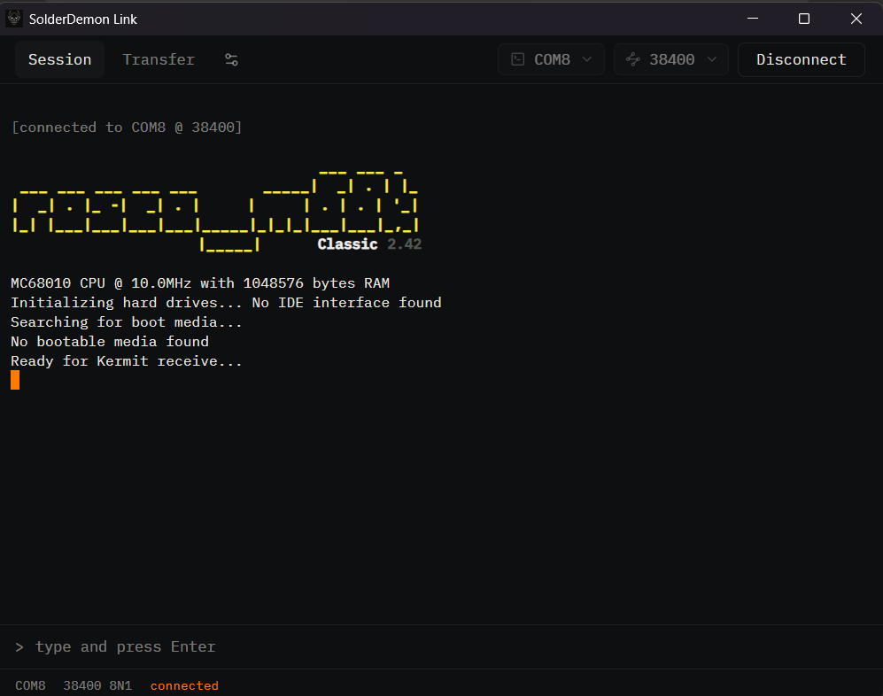
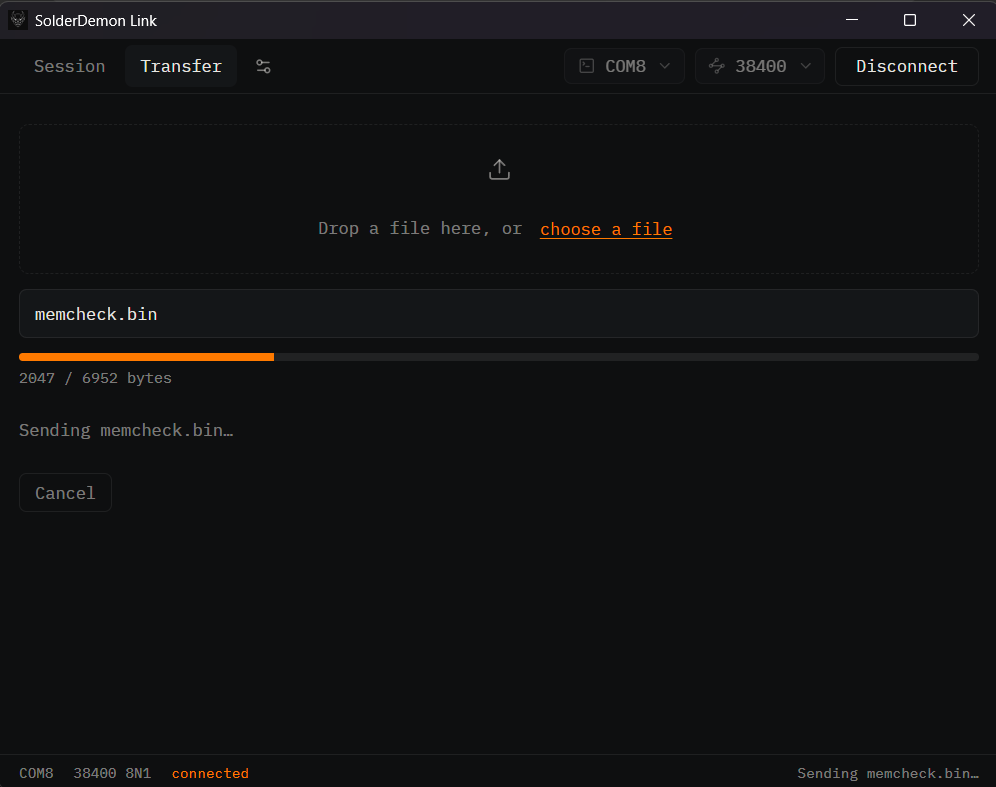

# SolderDemon Link

A small cross-platform desktop app for talking to serial devices — built for
[rosco_m68k](https://rosco-m68k.com/) boards but useful for any 8-N-1 serial
target. It pairs a real terminal with one-click firmware uploads over the
classic Kermit protocol.

Built with **Tauri v2**, **React 19** and **TypeScript**, with a **Rust**
backend owning the serial runtime and transfer protocol.

## Screenshots





## Features

- **Serial terminal** — a full [xterm.js](https://xtermjs.org/) emulator that
  interprets CR/LF, cursor moves and ANSI colour, so progress lines and ASCII
  art from the device render correctly. Scrollback survives tab switches.
- **Port auto-detection** — available ports are enumerated and labelled by kind
  (USB, Bluetooth, PCI, Serial). On Windows the app listens for OS
  device-change notifications instead of polling, so plugging or unplugging an
  adapter updates the list instantly.
- **Configurable baud rate** — 9600 / 19200 / 38400 / 57600 / 115200, fixed
  8-N-1 with no flow control for an 8-bit-clean path. Port and baud are
  remembered between sessions.
- **Firmware transfer** — send a `.bin` file to the device over a minimal
  classic Kermit sender (drag-and-drop or file picker), with a live progress
  bar and cancellation.
- **Localised UI** — English and Ukrainian, switchable in Settings.

## Project layout

```
src/             Frontend — React UI, i18n, Tauri command/event usage
  App.tsx        Main window: tabs, terminal, transfer and settings views
  Dropdown.tsx   Custom dropdown control
  locales/       en.json / uk.json translation strings
src-tauri/       Rust backend
  src/lib.rs     Serial commands (open/close/read/write, port listing,
                 Windows device-change watcher) and Tauri wiring
  src/kermit.rs  Minimal classic Kermit file sender
  tauri.conf.json  App + bundle configuration
```

The frontend invokes Tauri commands and reacts to emitted events; it does not
implement the serial protocol itself. The Rust backend owns the serial runtime
and Kermit transfer behaviour and does not own UI state. See the `AGENTS.md`
files in each subtree for more detail.

## Getting started

### Prerequisites

- [Node.js](https://nodejs.org/) (LTS)
- [Rust](https://www.rust-lang.org/tools/install) (stable toolchain)
- Platform dependencies for Tauri — see the
  [Tauri prerequisites guide](https://tauri.app/start/prerequisites/). On Linux
  you'll need `libwebkit2gtk-4.1-dev`, `librsvg2-dev`, `patchelf`,
  `libudev-dev` and friends.

### Development

```bash
npm install
npm run tauri dev
```

### Build

```bash
npm run tauri build
```

Installers are produced for the host platform under
`src-tauri/target/release/bundle/`.

## Releases

Pushes to `main` trigger the [release workflow](.github/workflows/release.yml),
which builds and publishes installers for macOS (Apple Silicon), Linux
(Ubuntu 22.04) and Windows via [tauri-action](https://github.com/tauri-apps/tauri-action).